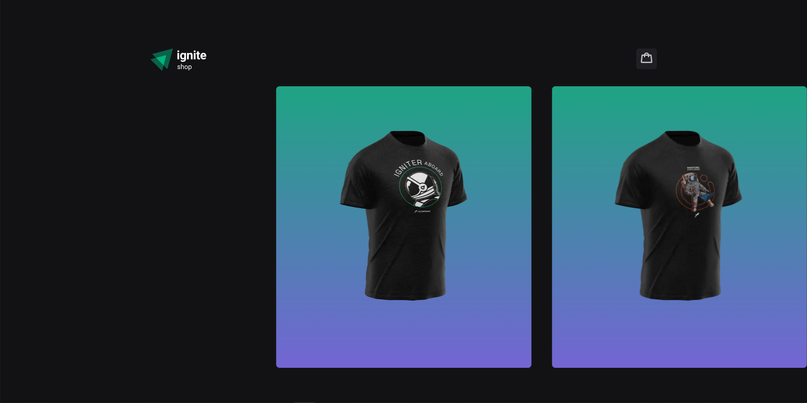

## IgniteShop

This application is a challenge from the rocketSeat programming course. Where the application is an online store that sells shirts.

Esta aplicação é um desafio do curso de programação rocketSeat. Onde a aplicação é uma loja online que vende camisas.

In this application there will be some products. You can see product information in the footer, such as price and name. It is also possible to add the product to the cart by clicking on the button on the side.

Nesta aplicação haverá alguns produtos. Pode se ver as informações do produto no rodapé, como por exemplo, o preço e o nome. É possivel também adicionar o produto ao carrinho clicando no botão ao lado.

By clicking on the product you will be redirected to a page where you will have more detailed information about the product.

Clicando no produto você será redirecionado a uma pagina onde terá informações mais detalhadas sobre o produto.

 

To access the cart you must click on the top right button of the page, clicking on it will open the cart where all the selected products will be together with the price to be paid.

Para acessar o carrinho você deve clicar no botão superior direito da pagina, clicando nela irá abrir o carrinho onde estará todos os produtos selecionados junto com o preço a ser pago.

 

Once you select the products that the user wants, it is possible to click on the "Finalizar Pedido" button, by doing this you will be redirected to the stripe page. There you can complete your purchase.

Assim que selecionar os produtos que o usuário deseja, é possivel clicar no botão "Finalizar Pedido", fazendo isso você será redirecionado a pagina do stripe. Nela você pode fazer a finalização da sua compra.

 

If the payment is successful, you will be redirected to the success page, where the chosen products will be presented along with a successful purchase message.

Se o pagamento for bem sucedido, você será redirecionado para a pagina de sucesso, onde será apresentado os produtos escolhidos junto com uma mensagem de compra bem sucedida.